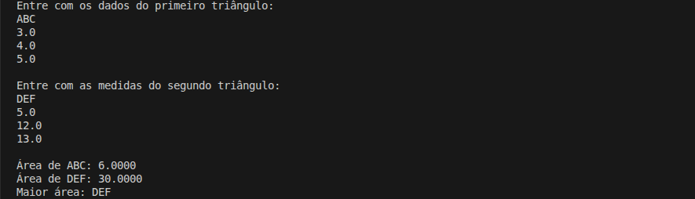

# Comparação das Áreas de Dois Triângulos

Projeto de estudo em C# com o objetivo de **calcular e comparar a área de dois triângulos** a partir das medidas de seus lados, utilizando a **fórmula de Heron**.

## Detalhes Gerais

- **Versão**: 0.2
- **Conceito aplicado:** Classes

## Descrição da Tag

Evolucao do modelo procedural para orientacao a objetos.

A classe Triangulo passa a concentrar os atributos dos lados e o metodo de calculo da area utilizando a formula de Heron.

O programa principal agora instancia objetos e delega o calculo a classe, iniciando o processo de modelagem de entidades.

## Exemplo de Execução

