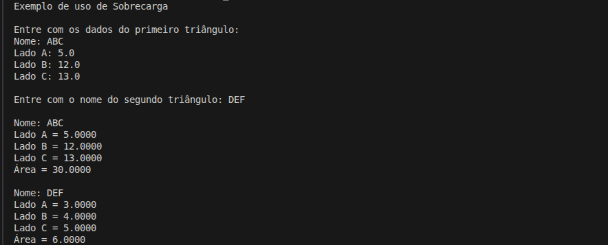

# Comparação das Áreas de Dois Triângulos

Projeto de estudo em C# com o objetivo de **calcular e comparar a área de dois triângulos** a partir das medidas de seus lados, utilizando a **fórmula de Heron**.

## Detalhes Gerais

- **Versão**: 0.5
- **Conceito aplicado:** Sobrecarga

## Descrição da Tag

Introduz o conceito de sobrecarga.

Permite a criacao de um triangulo informando apenas o nome, utilizando valores padrao para os lados e delegando a construcao ao construtor principal por meio de encadeamento.

## Exemplo de Execução

