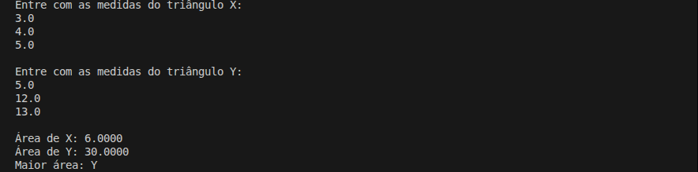

# Comparação das Áreas de Dois Triângulos

Projeto de estudo em C# com o objetivo de **calcular e comparar a área de dois triângulos** a partir das medidas de seus lados, utilizando a **fórmula de Heron**.

## Detalhes Gerais

- **Versão**: 0.1
- **Conceito aplicado:** Solução Procedural

## Descrição da Tag

Primeira versão do projeto.

Implementação direta e totalmente procedural, sem uso de classes ou métodos.

O objetivo principal desta versão é estabelecer a base lógica do problema antes da introdução de conceitos de orientação a objetos.

## Exemplo de Execução

