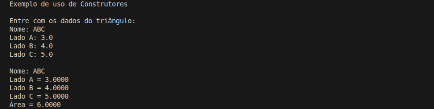

# Comparação das Áreas de Dois Triângulos

Projeto de estudo em C# com o objetivo de **calcular e comparar a área de dois triângulos** a partir das medidas de seus lados, utilizando a **fórmula de Heron**.

## Detalhes Gerais

- **Versão**: 0.4
- **Conceito aplicado:** Construtores

## Descrição da Tag

Evolucao do modelo de instanciacao da classe.

A criacao do objeto passa a exigir parametros no construtor, garantindo que todo triangulo possua um nome valido no momento da instanciacao.

O metodo CriarTriangulo foi atualizado para utilizar o novo construtor.

## Exemplo de Execução

