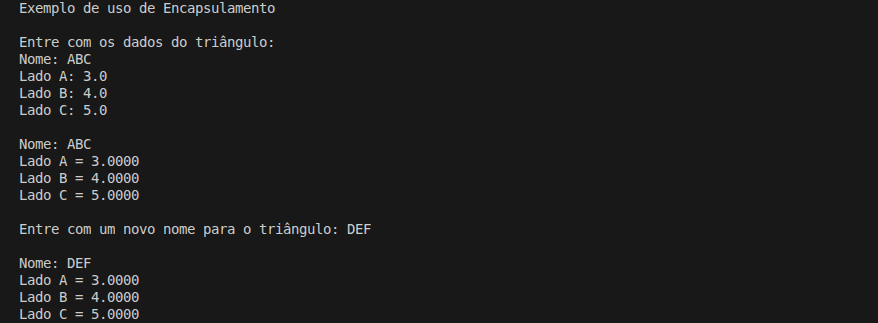

# Comparação das Áreas de Dois Triângulos

Projeto de estudo em C# com o objetivo de **calcular e comparar a área de dois triângulos** a partir das medidas de seus lados, utilizando a **fórmula de Heron**.

## Detalhes Gerais

- **Versão**: 0.6.1
- **Conceito aplicado:** Encapsulamento com Auto-Properties

## Descrição da Tag

Refatoracao interna da classe.

Substitui a implementacao manual das properties por auto-properties com setter privado, simplificando o codigo sem alterar o comportamento externo da classe.

## Exemplo de Execução

