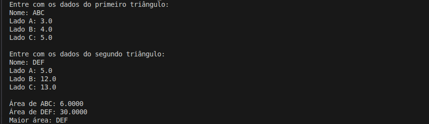

# Comparação das Áreas de Dois Triângulos

Projeto de estudo em C# com o objetivo de **calcular e comparar a área de dois triângulos** a partir das medidas de seus lados, utilizando a **fórmula de Heron**.

## Detalhes Gerais

- **Versão**: 0.2.1
- **Conceito aplicado:** Refatoração de código

## Descrição da Tag

Refatoracao estrutural do programa principal.

A execucao do fluxo foi centralizada em SolucaoProblema e a leitura, exibicao e comparacao foram separadas em metodos auxiliares (ConstruirTriangulo, ExibirArea e CompararAreas), deixando o codigo mais legivel e didatico.

## Exemplo de Execução

