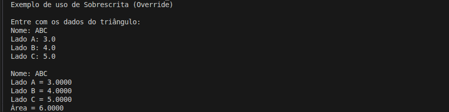

# Comparação das Áreas de Dois Triângulos

Projeto de estudo em C# com o objetivo de **calcular e comparar a área de dois triângulos** a partir das medidas de seus lados, utilizando a **fórmula de Heron**.

## Detalhes Gerais

- **Versão**: 0.3
- **Conceito aplicado:** Sobrescrita (Override)

## Descrição da Tag

Introduz representacao textual da entidade.

A classe passa a sobrescrever o metodo ToString para exibir seus atributos e a area calculada, concentrando tambem a logica de exibicao dentro da propria entidade.

## Exemplo de Execução

