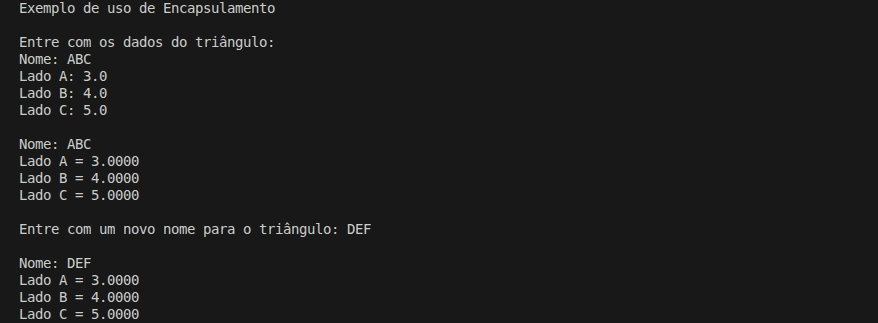

# Comparação das Áreas de Dois Triângulos

Projeto de estudo em C# com o objetivo de **calcular e comparar a área de dois triângulos** a partir das medidas de seus lados, utilizando a **fórmula de Heron**.

## Detalhes Gerais

- **Versão**: 0.6.3
- **Conceito aplicado:** Refatoração de Código

## Descrição da Tag

Refatoracao da regra de validacao do atributo Nome.

O construtor passa a aplicar fallback automatico para nome generico apenas durante a criacao do objeto, enquanto o setter ignora valores invalidos, preservando o estado atual.

A validacao foi isolada no metodo NomeValido, eliminando efeitos colaterais indesejados.

## Exemplo de Execução

